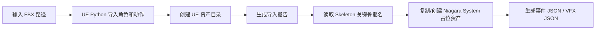
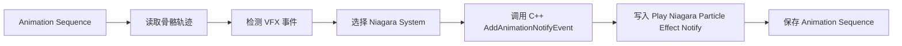

# WorldFlex-4D Avatar 粒子特效工作进展与自动化流程汇报

日期：2026-06-04

## 1. 当前负责范围

当前工作只聚焦在 4D Avatar pipeline 中的粒子特效部分，暂不负责 3D mesh 生成、骨骼绑定、动作生成网络和 4D decoder 训练。

本阶段目标是：

- 将已有角色资产和动作资产导入 UE5。
- 基于 Niagara 生成或复用火焰、闪电、拖尾、命中爆点、脚步特效。
- 梳理 VFX 与动作绑定的自动化流程。
- 为后续 scaling up 准备可结构化记录的事件格式。

## 2. 当前 Source / 输入资源

### 2.1 角色与动作 FBX

学长提供的本地 FBX 文件：

| 类型 | 文件 | 用途 |
| --- | --- | --- |
| 角色资产 | `D:/assets/luffi_sample/luffi (2).fbx` | Luffi 角色 Skeletal Mesh |
| 动作 | `D:/assets/luffi_sample/Mma Kick.fbx` | 踢击动作，适合测试脚部火焰、脚部拖尾、踢击爆点 |
| 动作 | `D:/assets/luffi_sample/Standing Melee Run Jump Attack (1)(1).fbx` | 跑跳攻击，适合测试跑动尘土、手部闪电、落地/命中爆点 |

### 2.2 UE 工程

当前使用的 UE 工程：

```text
D:/document/Unreal Projects/特效探索/特效探索.uproject
```

UE 版本：

```text
D:/UE_5.7
```

### 2.3 官方 Niagara Examples

已下载并导入 Epic 官方 Niagara Examples Pack，本地路径：

```text
D:/document/Unreal Projects/特效探索/Content/NiagaraExamples
```

UE 内路径：

```text
/Game/NiagaraExamples
```

目前筛选出的可直接用于本任务的官方特效：

| 类型 | UE Niagara System 路径 | 建议用途 |
| --- | --- | --- |
| 火焰 | `/Game/NiagaraExamples/FX_Misc/NS_Fire` | 常驻/短时火焰 |
| 脚步火焰 | `/Game/NiagaraExamples/FX_Footstep/NS_Footstep_Fire` | 右脚踢击火焰、跑动脚火 |
| NDC 脚步火焰 | `/Game/NiagaraExamples/FX_NDC/NS_NDC_Footsteps_Fire` | 数据通道脚步火焰，可作为后续自动事件参考 |
| 闪电 | `/Game/NiagaraExamples/FX_Player/NS_Player_Electricity_Looping` | 手部闪电、角色通电效果 |
| Tesla 电弧 | `/Game/NiagaraExamples/FX_Ribbons/NS_TeslaCoil` | 电弧/闪电束参考 |
| 武器拖尾 | `/Game/NiagaraExamples/FX_Weapons/Trails/NS_SimpleRibbonTrail` | 手部/武器拖尾 |
| 火箭拖尾 | `/Game/NiagaraExamples/FX_Weapons/Trails/NS_RocketTrail` | 高速移动拖尾参考 |
| 火花爆点 | `/Game/NiagaraExamples/FX_Sparks/NS_Spark_Burst` | 命中火花 |
| 持续火花 | `/Game/NiagaraExamples/FX_Sparks/NS_Spark_Continuous` | 持续放电/蓄力火花 |
| 命中效果 | `/Game/NiagaraExamples/FX_Weapons/Impacts/NS_Impact_Metal` | 命中金属/武器打击 |
| 命中效果 | `/Game/NiagaraExamples/FX_Weapons/Impacts/NS_Impact_Concrete` | 地面/墙面命中 |
| 小爆炸 | `/Game/NiagaraExamples/FX_Explosions/NS_Explosion_Small` | 落地/重击爆点 |

## 3. 已完成工作

### 3.1 自动导入 Luffi 角色与动作

已经通过 UE Python 脚本将角色和两个动作导入 UE 工程。

导入目标路径：

```text
/Game/WorldFlex/LuffiVFXTest
```

已导入资产：

| 类型 | UE 路径 |
| --- | --- |
| 角色 Skeletal Mesh | `/Game/WorldFlex/LuffiVFXTest/Character/luffi__2_` |
| Skeleton | `/Game/WorldFlex/LuffiVFXTest/Character/luffi__2__Skeleton` |
| 材质 | `/Game/WorldFlex/LuffiVFXTest/Character/Material_0` |
| 踢击动画 | `/Game/WorldFlex/LuffiVFXTest/Animations/Mma_Kick` |
| 跑跳攻击动画 | `/Game/WorldFlex/LuffiVFXTest/Animations/Standing_Melee_Run_Jump_Attack__1__1_` |

对应脚本：

```text
D:/document/4D-avatar/scripts/ue/import_luffi_vfx_sample.py
```

导入报告：

```text
D:/document/4D-avatar/samples/luffi_vfx_test/ue_import_report.json
```

### 3.2 创建了本地 VFX 测试样本结构

测试样本目录：

```text
D:/document/4D-avatar/samples/luffi_vfx_test
```

其中包括：

| 文件 | 作用 |
| --- | --- |
| `manifest.json` | 记录角色 FBX、动作 FBX、事件文件、特效文件路径 |
| `motion/mma_kick.events.json` | 踢击动作的初始事件标注 |
| `motion/standing_melee_run_jump_attack.events.json` | 跑跳攻击动作的初始事件标注 |
| `vfx/mma_kick.emitters.json` | 踢击动作对应 VFX 配置 |
| `vfx/standing_melee_run_jump_attack.emitters.json` | 跑跳攻击动作对应 VFX 配置 |

这些 JSON 目前主要用于记录特效事件结构，方便后续从手动标注过渡到自动检测。

### 3.3 创建了第一版占位 Niagara 资产

在 UE 工程中创建了以下占位 Niagara System：

```text
/Game/WorldFlex/LuffiVFXTest/Niagara/NS_KickFootAfterimage
/Game/WorldFlex/LuffiVFXTest/Niagara/NS_ImpactBurstSmall
/Game/WorldFlex/LuffiVFXTest/Niagara/NS_RunDustSmall
/Game/WorldFlex/LuffiVFXTest/Niagara/NS_HandFireSmall
/Game/WorldFlex/LuffiVFXTest/Niagara/NS_FootFireTrail
/Game/WorldFlex/LuffiVFXTest/Niagara/NS_LightningArcSmall
```

说明：

- 这些不是从零手写复杂 Niagara 模块，而是从 UE 自带 Niagara 模板复制出的第一版可播放资产。
- 后续更推荐直接使用 `/Game/NiagaraExamples` 里的官方高质量特效。
- 这些占位资产保留用于快速测试自动化导入和 Notify 挂载流程。

对应脚本：

```text
D:/document/4D-avatar/scripts/ue/create_luffi_vfx_niagara_assets.py
D:/document/4D-avatar/scripts/ue/create_luffi_fire_lightning_niagara.py
```

### 3.4 读取了 Luffi 骨骼信息

已通过 UE Python 读取 Luffi skeleton 的 reference pose，关键骨骼如下：

| 语义 | 骨骼名 |
| --- | --- |
| 身体/骨盆/root 替代 | `Hips` |
| 右手 | `RightHand` |
| 右脚 | `RightFoot` |
| 左手 | `LeftHand` |
| 左脚 | `LeftFoot` |

当前模型没有 Socket，因此 Animation Notify 中的 `Socket Name` 可以先直接填写骨骼名，例如 `RightFoot` 或 `RightHand`。

骨骼报告：

```text
D:/document/4D-avatar/samples/luffi_vfx_test/luffi_bones.json
```

## 4. 当前手动使用流程

### 4.1 打开工程

```text
D:/document/Unreal Projects/特效探索/特效探索.uproject
```

建议将 UE 界面语言切换为英文，方便和教程、API、资产名对应：

```text
Edit > Editor Preferences > Region & Language > Editor Language > English
```

### 4.2 在动画中挂 Niagara

打开动画：

```text
/Game/WorldFlex/LuffiVFXTest/Animations/Mma_Kick
```

在 `Notify` 轨道上添加：

```text
Add Notify > Play Niagara Particle Effect
```

推荐测试配置：

| 动作阶段 | Niagara System | Attached | Socket Name |
| --- | --- | --- | --- |
| 踢腿拖尾/脚火 | `/Game/NiagaraExamples/FX_Footstep/NS_Footstep_Fire` | true | `RightFoot` |
| 踢击命中火花 | `/Game/NiagaraExamples/FX_Sparks/NS_Spark_Burst` | true | `RightFoot` |

跑跳攻击动画：

```text
/Game/WorldFlex/LuffiVFXTest/Animations/Standing_Melee_Run_Jump_Attack__1__1_
```

推荐测试配置：

| 动作阶段 | Niagara System | Attached | Socket Name |
| --- | --- | --- | --- |
| 跑动脚火/尘土 | `/Game/NiagaraExamples/FX_Footstep/NS_Footstep_Fire` | true | `RightFoot` |
| 手部闪电 | `/Game/NiagaraExamples/FX_Player/NS_Player_Electricity_Looping` | true | `RightHand` |
| 落地/命中爆点 | `/Game/NiagaraExamples/FX_Sparks/NS_Spark_Burst` 或 `/Game/NiagaraExamples/FX_Explosions/NS_Explosion_Small` | true | `Hips` / `RightHand` |

## 5. 自动化流程现状

### 5.1 已经自动化的部分

目前已经完成或验证可行的自动化：



已经自动化的能力：

- 角色 FBX 导入为 Skeletal Mesh。
- 动作 FBX 导入为 Animation Sequence。
- 自动记录导入报告。
- 自动创建 `/Game/WorldFlex/LuffiVFXTest/Niagara` 目录。
- 自动复制 UE Niagara 模板生成占位特效资产。
- 自动读取 Luffi 的骨骼名。
- 自动维护事件 JSON 和 VFX JSON。

### 5.2 目前仍需要手动的部分

当前仍需要手动操作：

- 在 UE Animation Editor 中打开动画。
- 找到特效出现的具体时间点。
- 手动添加 `Play Niagara Particle Effect` Notify。
- 在 Notify 里选择 Niagara System 并填写 `Socket Name`。

原因：

- UE5.7 Python 中暴露了 `AnimNotify_PlayNiagaraEffect`、`NiagaraSystemFactoryNew` 等类。
- 但当前 Python 环境没有暴露 `AnimationBlueprintLibrary`，也没有在 `AnimSequencerController` 中暴露 notify 写入方法。
- 因此纯 Python 脚本暂时不能稳定地直接把 Niagara Notify 写入 Animation Sequence。

已验证报告：

```text
D:/document/4D-avatar/samples/luffi_vfx_test/niagara_api_probe.json
D:/document/4D-avatar/samples/luffi_vfx_test/anim_controller_probe.json
```

## 6. 后续自动绑定方案

后续自动绑定可以分两步实现。

### 6.1 自动检测动作事件

输入：

```text
Animation Sequence
骨骼名：RightFoot / RightHand / Hips
特效类型：trail / impact / fire / lightning / dust
```

逐帧读取骨骼轨迹，计算：

- 骨骼位置。
- 速度峰值。
- 加速度变化。
- 骨骼高度。
- 与地面或接触点的近似关系。

规则示例：

| 事件 | 自动检测规则 |
| --- | --- |
| 拖尾开始 | `RightFoot` 或 `RightHand` 速度超过阈值 |
| 拖尾结束 | 速度回落到阈值以下 |
| 命中爆点 | 速度峰值后短时间内出现减速，或手/脚高度接近地面 |
| 跑动尘土 | `Hips` 有持续位移，同时脚部周期性接近地面 |
| 手部闪电 | 攻击动作的挥手区间内绑定 `RightHand` |

输出：

```json
[
  {
    "frame": 14,
    "type": "trail_start",
    "bone": "RightFoot",
    "niagara": "/Game/NiagaraExamples/FX_Footstep/NS_Footstep_Fire"
  },
  {
    "frame": 23,
    "type": "impact",
    "bone": "RightFoot",
    "niagara": "/Game/NiagaraExamples/FX_Sparks/NS_Spark_Burst"
  }
]
```

更具体的 C++ 方案见：

```text
docs/UE5-C++-VFX自动绑定方案.md
```

核心接口：

```cpp
UAnimationBlueprintLibrary::GetBonePoseForFrame(...)
UAnimationBlueprintLibrary::GetBonePosesForFrame(...)
```

### 6.2 自动写入 Animation Notify

UE C++ 中存在可用接口：

```text
UAnimationBlueprintLibrary::AddAnimationNotifyTrack
UAnimationBlueprintLibrary::AddAnimationNotifyEvent
```

Niagara Notify 使用：

```cpp
UAnimNotify_PlayNiagaraEffect
```

需要设置的字段：

```cpp
Template
Attached
SocketName
LocationOffset
RotationOffset
Scale
```

因此全自动写入 Notify 的推荐实现路径是：

```text
UE Editor C++ 小插件 / Animation Modifier
```

目标流程：



插件输入：

| 参数 | 示例 |
| --- | --- |
| Animation | `/Game/WorldFlex/LuffiVFXTest/Animations/Mma_Kick` |
| Bone | `RightFoot` |
| VFX | `/Game/NiagaraExamples/FX_Footstep/NS_Footstep_Fire` |
| Rule | `speed_peak` / `contact` / `run_loop` |

插件输出：

- 自动新增 Notify Track。
- 自动添加 Niagara Notify。
- 自动设置 `Template`。
- 自动设置 `Attached = true`。
- 自动设置 `Socket Name = RightFoot / RightHand / Hips`。
- 自动保存动画资产。

第一版建议先做 Editor-only 插件或 Animation Modifier，不走运行时逻辑。这样可以在编辑器里批处理动画资产，输出 `events.json` 和 `bind_report.json`，并把 `Play Niagara Particle Effect` Notify 写入 Animation Sequence。

## 7. 当前结论

当前 VFX 任务已经跑通了基础链路：

```text
FBX 角色/动作 -> UE 导入 -> NiagaraExamples 官方特效 -> 骨骼挂载 -> Animation Notify 触发
```

目前可交付结果：

- Luffi 角色和两个动作已导入 UE。
- 官方 Niagara Examples 已导入工程。
- 已筛选出火焰、闪电、拖尾、命中火花等可用特效。
- 已确认关键骨骼名：`RightFoot`、`RightHand`、`Hips`。
- 已建立事件 JSON / VFX JSON 的结构化表示。
- 已明确当前 Python 自动化能力边界。
- 已提出后续 C++ Editor 插件实现全自动绑定的方案。

建议下一步：

1. 先用官方 Niagara Examples 手动完成 1-2 个动作的视觉 demo。
2. 固定 VFX 资产选择和风格尺度。
3. 实现自动事件检测，先输出 `events.json`。
4. 再写 UE Editor C++ 插件/Animation Modifier，把事件自动写入 Animation Notify。

## 8. 相关文件

| 文件 | 说明 |
| --- | --- |
| `docs/Luffi-VFX-UE5-Quickstart.md` | 中文 UE/Niagara 操作手册 |
| `docs/WorldFlex-4D-Avatar-粒子特效.md` | 粒子特效方向日志 |
| `samples/luffi_vfx_test/manifest.json` | 测试样本 manifest |
| `samples/luffi_vfx_test/ue_import_report.json` | UE 导入报告 |
| `samples/luffi_vfx_test/luffi_bones.json` | Luffi 骨骼名报告 |
| `scripts/ue/import_luffi_vfx_sample.py` | 自动导入 Luffi 与动作的 UE Python 脚本 |
| `scripts/ue/create_luffi_vfx_niagara_assets.py` | 自动创建基础 Niagara 占位资产 |
| `scripts/ue/create_luffi_fire_lightning_niagara.py` | 自动创建火焰/闪电占位资产 |
| `schemas/motion_events.schema.json` | 动作事件 schema |
| `schemas/vfx_emitters.schema.json` | VFX emitter schema |
| `docs/UE5-C++-VFX自动绑定方案.md` | C++ 自动检测事件与自动写入 Niagara Notify 方案 |
